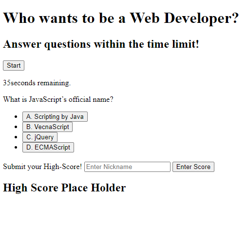

# Who wants to be a Web Developer

Do you want to be a web developer? Then you're going to want to have the technical knowledge necessary for your upcoming interview questions. Challenge yourself by taking this quiz.

## Taking the Quiz

You can begin the quiz by clicking the start button. When clicked, the first question will populate. For reference, review this screenshot:

### Multiple Choice

Selections are presented in multiple choice format. Only one of these options is the correct answer. Selections will be marked "Correct" or "Incorrect" immediately.

### Timing is everything

Did we forget to mention that this is timed? You will have 75 seconds to complete the quiz. Your score will based on your remaining time. However, careless answers will not be rewarded. An incorrect response will cost you 10 seconds!

### Climb to the top!

If you complete the quiz, you will have the option to enter a nickname along with your score. Your name and time will then be stored on a leadboard you can see on the right side of the page. 

**NOTE:** This feature is still in development.

#### Try it yourself!

[You can take on the challenge here.](https://littmarque27.github.io/who-wants-to-be-a-web-dev/)
